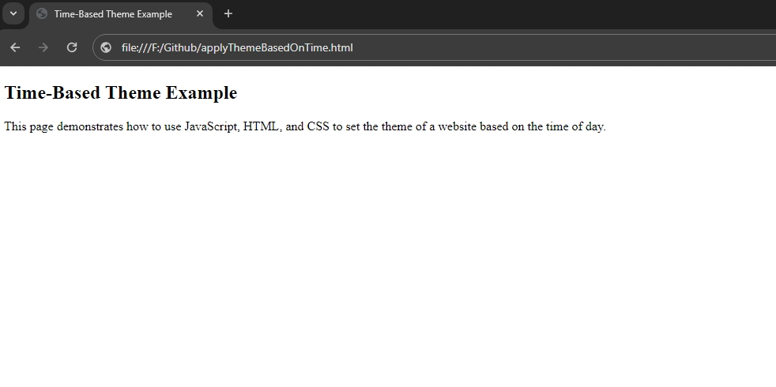
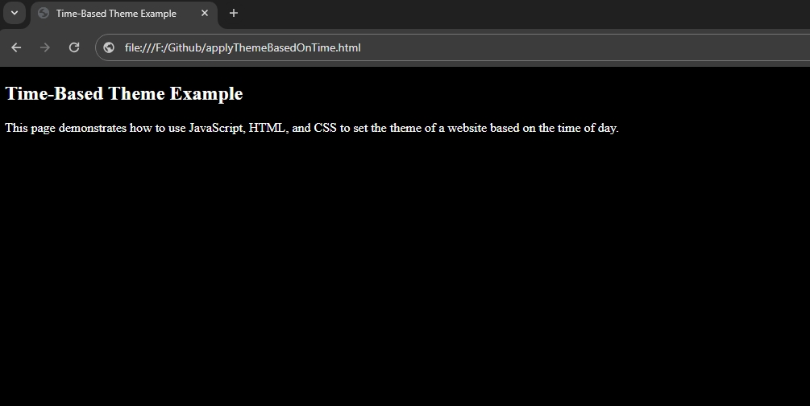

# Time-Based Theme Example
Apply theme based on time

If it's night (between 8 PM and 6 AM), apply a .night-theme CSS class to the "body" tag; otherwise, apply a .day-theme class.
- day theme

- night theme

